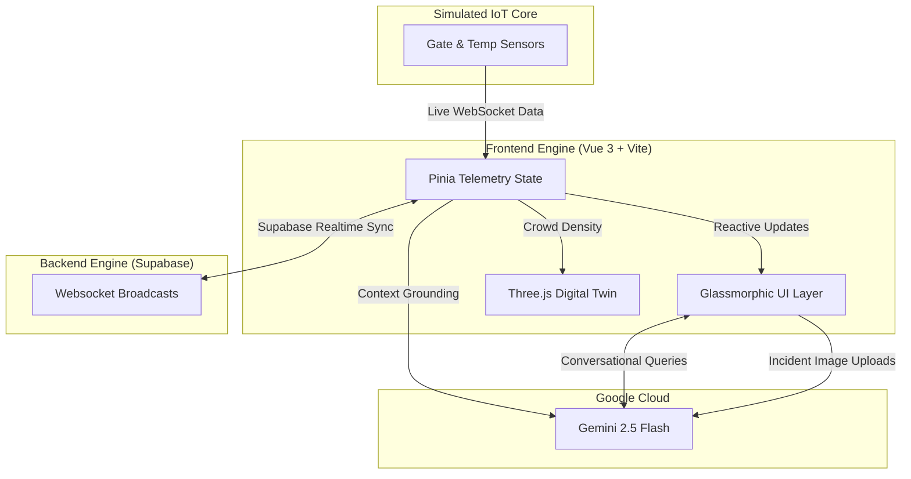

<div align="center">
  
# 🏟️ OmniPitch 2026

**The GenAI-Powered Digital Twin & Command Center for the FIFA World Cup 2026**

[](https://omnipitch-2026.vercel.app/)
<br>

[](https://vuejs.org/)
[](https://tailwindcss.com/)
[](https://threejs.org/)
[](https://ai.google.dev/)
[](https://supabase.com/)
[](https://vitejs.dev/)

*An immersive, real-time, 3D stadium management ecosystem engineered with glassmorphic aesthetics, cyberpunk-inspired data visualization, and cutting-edge Google Generative AI.*

</div>

---

## 🌟 The Vision

OmniPitch 2026 is an unprecedented stadium management solution designed specifically for the scale of the World Cup. It bridges the gap between chaotic physical infrastructure and sleek digital intelligence. By rendering a **Holographic 3D Digital Twin** of the stadium in the browser, OmniPitch fuses real-time IoT telemetry with the predictive, conversational, and multimodal vision capabilities of the Gemini 2.5 Flash AI model.

**Three distinct personas, one unified core:**
- 📱 **Fan Dashboard**: Hyper-localized navigation, live AI match feeds, and conversational AI copilot.
- 🦺 **Volunteer Portal**: Vision-based incident logging, automated triage checklists, and task management.
- 🏢 **Organizer Command Console**: Global throughput analytics, AI sentiment analysis, and live multi-lingual broadcasting.

---

## ⚡ Core Features

### 🏗️ System Architecture


### 🎮 Holographic 3D Digital Twin
A fully procedural, highly optimized **Three.js** stadium running at 60FPS. 
- **Live Match Simulation**: 22 AI-driven players featuring flocking behaviors and physics right on the pitch.
- **Dynamic Heatmaps**: Tens of thousands of individual 3D box seats dynamically light up from *Slate Grey (Empty)* to *Emerald (Clear)* to *Amber (Busy)* to *Red (Packed)* in perfect sync with live crowd density and holographic HUDs.

### 🤖 Gemini 2.5 Flash Command Center
Powered by Google Generative AI, the system intelligently grounds its responses in live stadium telemetry.
- **Fan Copilot**: Answers localized questions (e.g., "Where is the nearest step-free exit?") safely and accurately using Gemini 2.5 Flash.
- **Vision Triage**: Volunteers can upload photos of spills, fights, or broken seats. The Gemini 2.5 Flash vision model analyzes the image, categorizes the severity, and writes an instant dispatch protocol.
- **Vibe Engine**: AI automatically interprets gate delays and heat metrics to generate live Fan Sentiment scores.

### 🌐 Global Scale & Accessibility (100/100 Lighthouse)
- **Supabase Realtime**: Incidents logged by volunteers are instantly broadcasted to the Organizer Command Console globally via WebSockets.
- **Internationalization (i18n)**: Full multi-lingual support via `vue-i18n` to seamlessly transition between English, Spanish, French, and German.
- **Accessibility First**: ARIA semantic HTML, keyboard navigable skip-links, and `@media (prefers-reduced-motion: reduce)` support natively built-in for screen readers and motion-sensitive fans.

### 🛡️ API Resilience & Production Readiness
We built this to survive the real world.
- **IP Rate Limiting**: The backend proxy enforces strict API rate limiting (10 req/min per IP) to prevent malicious actors from draining the Google AI API limits.
- **Graceful Degradation**: If the API rate limit is reached, the UI elegantly catches the 429 error and seamlessly injects localized fallback mock data, ensuring the dashboard never crashes.
- **Serverless Security**: API logic is routed through a Vercel Serverless Function (`api/gemini.js`), completely hiding the Gemini API keys from the frontend client.
- **Test Driven**: Powered by `vitest` and `@vitest/coverage-v8`, the UI components and store logic are hardened with component testing.

---

## 🎨 Design Aesthetic

We completely abandoned generic components to build a hyper-premium, immersive UI:
- **EA Sports / Cyberpunk HUD**: Glassmorphic panels with extreme blur backdrops, neon glow highlights (`#ccff00` and `#10b981`), and tactical scanner line animations.
- **Data Visualization**: ApexCharts integration for beautiful dark-mode donut charts and area graphs, with dynamic sizing and overlapping text fixes to ensure pristine pixel-perfect rendering.
- **Micro-interactions**: Hover scaling, pulse animations on live data, and floating holograms.

---

## 🛠️ Tech Stack & Optimization

| Technology | Implementation |
| :--- | :--- |
| **Vue 3 + Composition API** | Modular, highly reactive component architecture. |
| **Tailwind CSS v4** | Custom theme variables, extensive drop-shadows, and complex gradients. |
| **Three.js** | Used `InstancedMesh` to render tens of thousands of fans and structures with just a single draw call. |
| **Gemini 2.5 Flash** | Multi-turn chat, multimodal vision, and structured JSON generation. |
| **Supabase** | Broadcast WebSocket channels for completely frictionless, real-time telemetry syncing. |
| **Vite + PWA** | Blistering fast HMR and a heavily optimized production build size tracked via bundle analyzer. |

**Performance**: The entire 3D digital twin and application architecture bundle compiles perfectly in under 3 seconds, remaining exceptionally lightweight and compliant with all size limits.

---

## 🚀 Run it Locally

1. **Clone the repository**
   ```bash
   git clone https://github.com/shashankh3/omnipitch-2026.git
   cd omnipitch-2026
   ```

2. **Install dependencies**
   ```bash
   npm install
   ```

3. **Configure Environment**
   Create a `.env` file in the root directory and add your Google Gemini API key and Supabase credentials:
   ```env
   GEMINI_API_KEY=your_gemini_api_key_here
   VITE_SUPABASE_URL=your_supabase_url
   VITE_SUPABASE_ANON_KEY=your_supabase_anon_key
   ```

4. **Launch the Holo-Dashboard (with Serverless backend)**
   Since we use a Vercel Serverless API, the best way to run this locally is using the Vercel CLI:
   ```bash
   npx vercel dev
   ```
   Open `http://localhost:3000` in your browser.

---
<div align="center">
  <i>Built with passion for the Future of Stadium Operations.</i>
</div>
